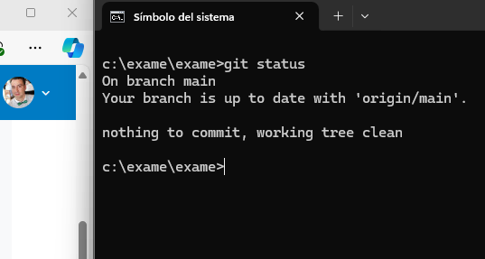

"Ejercicio de Git do exame"

 - 👋 Hola, soy el usuario @Edertg-git
 
 -	Vamos a agregar el directorio /img para colocar la captura de pantalla
 
 -	A continuación realizamos el comando git status.
 
 ##Agregamos la capura de pantalla
 
